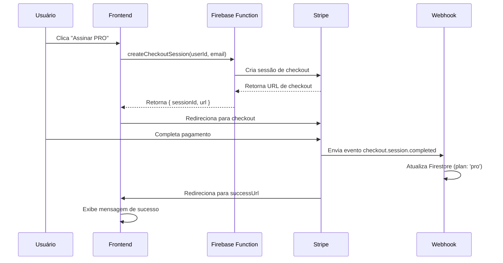
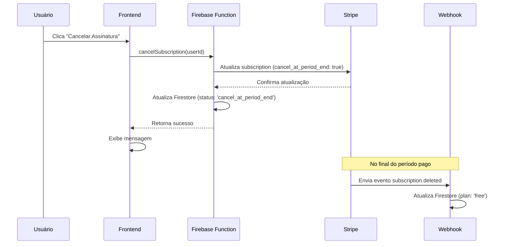
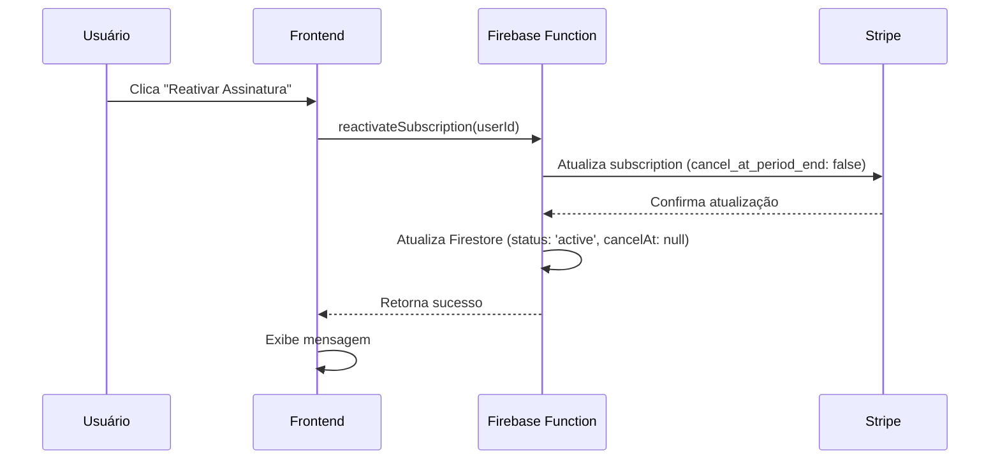

# 💳 Documentação Completa - Integração Stripe

> **Versão:** 1.0  
> **Última atualização:** Janeiro 2026  
> **Status:** ✅ Completa

---

## 📋 Índice

1. [Visão Geral](#-visão-geral)
2. [Arquitetura](#-arquitetura)
3. [Serviços](#-serviços)
4. [Hooks](#-hooks)
5. [Componentes](#-componentes)
6. [Firebase Functions](#-firebase-functions)
7. [Configuração](#-configuração)
8. [Fluxos](#-fluxos)
9. [Exemplos de Uso](#-exemplos-de-uso)

---

## 🎯 Visão Geral

A integração Stripe permite que médicos assinem o plano PRO através de assinaturas recorrentes. O sistema gerencia todo o ciclo de vida da assinatura: criação, cancelamento, reativação e sincronização via webhooks.

### Funcionalidades

- ✅ Checkout de assinatura (Stripe Checkout)
- ✅ Cancelamento de assinatura (no final do período pago)
- ✅ Reativação de assinatura
- ✅ Sincronização automática via webhooks
- ✅ Gerenciamento de status no Firestore
- ✅ Cálculo automático de data de término

### Arquitetura

```
Frontend (React)
├── Hooks (useStripeCheckout, useCancelSubscription, useReactivateSubscription)
├── Services (stripe.service.js, subscription.service.js)
└── Components (StripeCheckoutButton)

Backend (Firebase Functions)
├── createCheckoutSession (Callable Function)
├── cancelSubscription (Callable Function)
├── reactivateSubscription (Callable Function)
└── stripeWebhook (HTTP Function)

Firestore
└── doctors/{userId}
    ├── plan: 'free' | 'pro'
    ├── stripeCustomerId
    ├── stripeSubscriptionId
    ├── stripeSubscriptionStatus
    ├── subscriptionCancelAt
    └── planUpdatedAt
```

---

## 🏗️ Arquitetura

### Frontend

**Localização:** `src/`

- **Hooks:** `src/hooks/stripe/`
- **Services:** `src/services/stripe/`
- **Components:** `src/components/stripe/`
- **Config:** `src/services/stripe/stripe.config.js`

### Backend

**Localização:** `functions/src/stripe/`

- **Functions:** `createCheckoutSession.ts`, `cancelSubscription.ts`, `reactivateSubscription.ts`, `webhook.ts`
- **Helpers:** `helpers.ts`
- **Types:** `types.ts`

### Fluxo de Dados

```
1. Usuário clica em "Assinar PRO"
   ↓
2. Frontend: useStripeCheckout → stripe.service.js
   ↓
3. Backend: createCheckoutSession (Firebase Function)
   ↓
4. Stripe API: Cria sessão de checkout
   ↓
5. Frontend: Redireciona para Stripe Checkout
   ↓
6. Usuário completa pagamento
   ↓
7. Stripe: Envia webhook para backend
   ↓
8. Backend: stripeWebhook atualiza Firestore
   ↓
9. Frontend: Usuário retorna e vê plano atualizado
```

---

## 🔧 Serviços

### `stripe.service.js`

**Arquivo:** `src/services/stripe/stripe.service.js`

Serviço principal para interação com Stripe no frontend.

#### **Funções**

##### `getStripe()`

Inicializa e retorna instância do Stripe (lazy loading).

```javascript
import { getStripe } from '@/services/stripe/stripe.service';

const stripe = await getStripe();
```

**Retorna:** `Promise<Stripe | null>`

##### `createCheckoutSession(userId, userEmail)`

Cria sessão de checkout no Stripe via Firebase Function.

```javascript
import { createCheckoutSession } from '@/services/stripe/stripe.service';

const checkoutData = await createCheckoutSession(user.uid, user.email);
// { sessionId: string, url: string }
```

**Parâmetros:**
- `userId` (string): ID do usuário no Firebase
- `userEmail` (string): Email do usuário

**Retorna:** `Promise<{ sessionId: string, url: string }>`

**Erros:**
- Lança erro se usuário não autenticado
- Lança erro se URL não for retornada

##### `redirectToCheckout(checkoutData)`

Redireciona usuário para página de checkout do Stripe.

```javascript
import { redirectToCheckout } from '@/services/stripe/stripe.service';

await redirectToCheckout(checkoutData);
```

**Parâmetros:**
- `checkoutData` (object): Objeto com `url` da sessão

**Comportamento:**
- Redireciona usando `window.location.href`
- Não retorna (navegação ocorre)

---

### `subscription.service.js`

**Arquivo:** `src/services/stripe/subscription.service.js`

Serviço para gerenciar assinaturas (cancelamento e reativação).

#### **Funções**

##### `cancelSubscription(userId)`

Cancela assinatura do usuário (no final do período pago).

```javascript
import { cancelSubscription } from '@/services/stripe/subscription.service';

const result = await cancelSubscription(user.uid);
// { success: boolean, message?: string, error?: string }
```

**Parâmetros:**
- `userId` (string): ID do usuário no Firebase

**Retorna:** `Promise<{ success: boolean, message?: string, error?: string }>`

**Comportamento:**
- Marca assinatura para cancelamento no final do período
- Usuário mantém acesso PRO até o final do período pago
- Atualiza `stripeSubscriptionStatus` para `'cancel_at_period_end'`

##### `reactivateSubscription(userId)`

Reativa assinatura cancelada.

```javascript
import { reactivateSubscription } from '@/services/stripe/subscription.service';

const result = await reactivateSubscription(user.uid);
// { success: boolean, message?: string, error?: string }
```

**Parâmetros:**
- `userId` (string): ID do usuário no Firebase

**Retorna:** `Promise<{ success: boolean, message?: string, error?: string }>`

**Comportamento:**
- Remove cancelamento agendado
- Mantém assinatura ativa
- Atualiza `stripeSubscriptionStatus` para `'active'`

---

### `stripe.config.js`

**Arquivo:** `src/services/stripe/stripe.config.js`

Configuração centralizada do Stripe.

```javascript
export const STRIPE_CONFIG = {
  publishableKey: import.meta.env.VITE_STRIPE_PUBLISHABLE_KEY || '',
  priceId: import.meta.env.VITE_STRIPE_PRICE_ID || '',
  successUrl: `${window.location.origin}/settings?success=true`,
  cancelUrl: `${window.location.origin}/settings?canceled=true`,
};

export const STRIPE_PLAN = {
  name: 'Plano PRO',
  price: 49.00,
  currency: 'BRL',
  interval: 'month',
};
```

**Variáveis de Ambiente:**
- `VITE_STRIPE_PUBLISHABLE_KEY`: Chave pública do Stripe
- `VITE_STRIPE_PRICE_ID`: ID do preço do produto PRO

---

## 🎣 Hooks

### `useStripeCheckout()`

**Arquivo:** `src/hooks/stripe/useStripeCheckout.js`

Hook para iniciar processo de checkout do Stripe.

#### **Uso**

```javascript
import { useStripeCheckout } from '@/hooks/stripe/useStripeCheckout';

function Component() {
  const { handleCheckout, loading, error } = useStripeCheckout();

  return (
    <button onClick={handleCheckout} disabled={loading}>
      {loading ? 'Processando...' : 'Assinar PRO'}
    </button>
  );
}
```

#### **Estados Retornados**

```typescript
{
  handleCheckout: () => Promise<void>,
  loading: boolean,
  error: string | null
}
```

#### **Comportamento**

- ✅ Verifica se usuário está autenticado
- ✅ Previne checkout se usuário já é PRO
- ✅ Cria sessão de checkout via Firebase Function
- ✅ Redireciona para Stripe Checkout
- ✅ Gerencia estados de loading e error

#### **Validações**

- Usuário deve estar autenticado
- Usuário não pode ser PRO (verifica `userPlan` do Firestore)

---

### `useCancelSubscription()`

**Arquivo:** `src/hooks/stripe/useCancelSubscription.js`

Hook para cancelar assinatura.

#### **Uso**

```javascript
import { useCancelSubscription } from '@/hooks/stripe/useCancelSubscription';

function Component() {
  const { handleCancel, loading, error } = useCancelSubscription();

  const handleClick = async () => {
    const result = await handleCancel();
    if (result.success) {
      alert('Assinatura será cancelada no final do período pago');
    }
  };

  return (
    <button onClick={handleClick} disabled={loading}>
      {loading ? 'Cancelando...' : 'Cancelar Assinatura'}
    </button>
  );
}
```

#### **Estados Retornados**

```typescript
{
  handleCancel: () => Promise<{ success: boolean, message?: string, error?: string }>,
  loading: boolean,
  error: string | null
}
```

#### **Comportamento**

- ✅ Verifica autenticação
- ✅ Chama Firebase Function para cancelar
- ✅ Retorna resultado da operação
- ✅ Gerencia estados de loading e error

---

### `useReactivateSubscription()`

**Arquivo:** `src/hooks/stripe/useReactivateSubscription.js`

Hook para reativar assinatura cancelada.

#### **Uso**

```javascript
import { useReactivateSubscription } from '@/hooks/stripe/useReactivateSubscription';

function Component() {
  const { handleReactivate, loading, error } = useReactivateSubscription();

  const handleClick = async () => {
    const result = await handleReactivate();
    if (result.success) {
      alert('Assinatura reativada com sucesso!');
    }
  };

  return (
    <button onClick={handleClick} disabled={loading}>
      {loading ? 'Reativando...' : 'Reativar Assinatura'}
    </button>
  );
}
```

#### **Estados Retornados**

```typescript
{
  handleReactivate: () => Promise<{ success: boolean, message?: string, error?: string }>,
  loading: boolean,
  error: string | null
}
```

#### **Comportamento**

- ✅ Verifica autenticação
- ✅ Chama Firebase Function para reativar
- ✅ Remove cancelamento agendado
- ✅ Retorna resultado da operação
- ✅ Gerencia estados de loading e error

---

## 🧩 Componentes

### `StripeCheckoutButton`

**Arquivo:** `src/components/stripe/StripeCheckoutButton.jsx`

Botão reutilizável para iniciar checkout do Stripe.

#### **Props**

```typescript
interface StripeCheckoutButtonProps {
  children?: React.ReactNode;        // Texto do botão (default: "Assinar PRO")
  variant?: 'primary' | 'secondary'; // Variante do botão (default: 'primary')
  className?: string;                // Classes CSS adicionais
  showPaymentInfo?: boolean;         // Mostrar "Cartão de crédito ou Pix" (default: true)
  showIcon?: boolean;                // Mostrar ícone Zap (default: true)
  [key: string]: any;                // Outras props do Button
}
```

#### **Uso**

```javascript
import StripeCheckoutButton from '@/components/stripe/StripeCheckoutButton';

// Uso básico
<StripeCheckoutButton>
  Assinar PRO - R$ 49/mês
</StripeCheckoutButton>

// Sem informações de pagamento e ícone
<StripeCheckoutButton
  showPaymentInfo={false}
  showIcon={false}
  className="upgrade-btn"
>
  Assinar PRO - R$ 49/mês
</StripeCheckoutButton>
```

#### **Comportamento**

- ✅ Usa `useStripeCheckout` internamente
- ✅ Gerencia loading state
- ✅ Exibe erros abaixo do botão
- ✅ Desabilita durante loading
- ✅ Suporta customização via props

---

## ⚡ Firebase Functions

### `createCheckoutSession`

**Arquivo:** `functions/src/stripe/createCheckoutSession.ts`

**Tipo:** Callable Function (v2)

Cria sessão de checkout no Stripe.

#### **Parâmetros**

```typescript
{
  userId: string;
  userEmail: string;
  priceId: string;
  successUrl?: string;
  cancelUrl?: string;
}
```

#### **Retorno**

```typescript
{
  sessionId: string;
  url: string;
}
```

#### **Comportamento**

- ✅ Valida dados obrigatórios
- ✅ Cria sessão de checkout no Stripe
- ✅ Configura modo `subscription`
- ✅ Define `client_reference_id` como `userId`
- ✅ Adiciona `userId` em metadata
- ✅ Retorna URL de checkout

#### **Configuração**

- Usa `defineSecret('STRIPE_SECRET_KEY')` ou `process.env.STRIPE_SECRET_KEY`
- CORS habilitado
- Máximo 10 instâncias

---

### `cancelSubscription`

**Arquivo:** `functions/src/stripe/cancelSubscription.ts`

**Tipo:** Callable Function (v2)

Cancela assinatura no final do período pago.

#### **Parâmetros**

```typescript
{
  userId: string;
}
```

#### **Retorno**

```typescript
{
  success: boolean;
  message: string;
}
```

#### **Comportamento**

- ✅ Busca dados do médico no Firestore
- ✅ Verifica se assinatura existe
- ✅ Atualiza assinatura no Stripe (`cancel_at_period_end: true`)
- ✅ Atualiza Firestore com status e data de cancelamento
- ✅ Mantém plano como PRO até o cancelamento

#### **Atualizações no Firestore**

```typescript
{
  stripeSubscriptionStatus: 'cancel_at_period_end',
  subscriptionCancelAt: Timestamp, // Data do cancelamento
  planUpdatedAt: serverTimestamp()
}
```

---

### `reactivateSubscription`

**Arquivo:** `functions/src/stripe/reactivateSubscription.ts`

**Tipo:** Callable Function (v2)

Reativa assinatura cancelada.

#### **Parâmetros**

```typescript
{
  userId: string;
}
```

#### **Retorno**

```typescript
{
  success: boolean;
  message: string;
}
```

#### **Comportamento**

- ✅ Busca dados do médico no Firestore
- ✅ Verifica se assinatura existe
- ✅ Remove cancelamento no Stripe (`cancel_at_period_end: false`)
- ✅ Atualiza Firestore removendo data de cancelamento
- ✅ Garante plano como PRO

#### **Atualizações no Firestore**

```typescript
{
  stripeSubscriptionStatus: 'active',
  subscriptionCancelAt: null, // Remove cancelamento
  plan: 'pro',
  planUpdatedAt: serverTimestamp()
}
```

---

### `stripeWebhook`

**Arquivo:** `functions/src/stripe/webhook.ts`

**Tipo:** HTTP Function (v2)

Processa eventos do Stripe via webhook.

#### **Endpoint**

```
POST https://[region]-[project].cloudfunctions.net/stripeWebhook
```

#### **Eventos Tratados**

##### `checkout.session.completed`

Quando checkout é completado com sucesso.

**Ações:**
- Atualiza plano para `'pro'`
- Salva `stripeCustomerId` e `stripeSubscriptionId`
- Define status como `'active'`

##### `customer.subscription.created` / `customer.subscription.updated`

Quando assinatura é criada ou atualizada.

**Ações:**
- Se `cancel_at_period_end`: mantém PRO, salva data de cancelamento
- Se `active`: define plano como PRO
- Se outro status: define plano como `'free'`

##### `customer.subscription.deleted`

Quando assinatura é deletada.

**Ações:**
- Define plano como `'free'`
- Remove `stripeSubscriptionId`
- Define status como `'canceled'`

##### `invoice.payment_succeeded`

Quando pagamento é bem-sucedido.

**Ações:**
- Atualiza `lastPaymentAt`
- Garante plano como PRO
- Atualiza status da assinatura

##### `invoice.payment_failed`

Quando pagamento falha.

**Ações:**
- Apenas loga warning
- Não altera plano imediatamente

#### **Segurança**

- ✅ Verifica assinatura do webhook (`stripe-signature`)
- ✅ Usa `STRIPE_WEBHOOK_SECRET` para validação
- ✅ Processa apenas eventos válidos

#### **Configuração**

- Usa `defineSecret('STRIPE_SECRET_KEY')` e `defineSecret('STRIPE_WEBHOOK_SECRET')`
- CORS habilitado
- Máximo 10 instâncias

---

### Helpers

**Arquivo:** `functions/src/stripe/helpers.ts`

Funções auxiliares para operações com Stripe e Firestore.

#### **Funções**

##### `updateDoctorPlan(userId, data)`

Atualiza dados do plano do médico no Firestore.

```typescript
await updateDoctorPlan(userId, {
  plan: 'pro',
  stripeSubscriptionStatus: 'active',
  planUpdatedAt: serverTimestamp()
});
```

##### `getUserIdFromEvent(event)`

Extrai `userId` de um evento do Stripe.

**Ordem de busca:**
1. `client_reference_id`
2. `metadata.userId`

##### `getSubscriptionId(subscriptionRef)`

Extrai `subscriptionId` de uma referência do Stripe.

**Suporta:**
- String direta
- Objeto com `id`
- `null` ou `undefined`

---

### Types

**Arquivo:** `functions/src/stripe/types.ts`

Tipos TypeScript para integração Stripe.

```typescript
export interface DoctorPlanData {
  plan: 'free' | 'pro';
  stripeCustomerId?: string | null;
  stripeSubscriptionId?: string | null;
  stripeSubscriptionStatus?: string | null;
  subscriptionCancelAt?: admin.firestore.Timestamp | null;
  planUpdatedAt?: admin.firestore.FieldValue | admin.firestore.Timestamp;
  lastPaymentAt?: admin.firestore.FieldValue | admin.firestore.Timestamp;
}

export type PlanStatus = 'free' | 'pro';
export type SubscriptionStatus = 
  | 'active' 
  | 'cancel_at_period_end' 
  | 'canceled' 
  | 'past_due' 
  | 'unpaid';
```

---

## ⚙️ Configuração

### Frontend

#### Variáveis de Ambiente

Crie arquivo `.env.local` na raiz do projeto:

```env
VITE_STRIPE_PUBLISHABLE_KEY=pk_test_...
VITE_STRIPE_PRICE_ID=price_...
```

#### Instalação de Dependências

```bash
npm install @stripe/stripe-js
```

---

### Backend

#### Configuração de Secrets (Recomendado)

```bash
# Configure a chave secreta do Stripe
firebase functions:secrets:set STRIPE_SECRET_KEY

# Configure o secret do webhook
firebase functions:secrets:set STRIPE_WEBHOOK_SECRET
```

**Nota:** Consulte `functions/CONFIGURAR_SECRETS.md` para instruções detalhadas.

#### Instalação de Dependências

```bash
cd functions
npm install stripe firebase-functions firebase-admin
```

#### Deploy

```bash
cd functions
npm run build
firebase deploy --only functions
```

---

### Stripe Dashboard

#### 1. Criar Produto e Preço

1. Acesse: https://dashboard.stripe.com/products
2. Crie produto "Plano PRO"
3. Configure preço recorrente: R$ 49,00/mês
4. Copie o **Price ID** (começa com `price_`)

#### 2. Configurar Webhook

1. Acesse: https://dashboard.stripe.com/webhooks
2. Clique em "Add endpoint"
3. URL: `https://[region]-[project].cloudfunctions.net/stripeWebhook`
4. Eventos a escutar:
   - `checkout.session.completed`
   - `customer.subscription.created`
   - `customer.subscription.updated`
   - `customer.subscription.deleted`
   - `invoice.payment_succeeded`
   - `invoice.payment_failed`
5. Copie o **Signing secret** (começa com `whsec_`)

---

## 🔄 Fluxos

### Fluxo de Checkout



### Fluxo de Cancelamento



### Fluxo de Reativação



---

## 💡 Exemplos de Uso

### Exemplo 1: Botão de Checkout Simples

```javascript
import StripeCheckoutButton from '@/components/stripe/StripeCheckoutButton';

function UpgradeCard() {
  return (
    <div className="upgrade-card">
      <h2>Upgrade para PRO</h2>
      <p>Desbloqueie recursos ilimitados</p>
      <StripeCheckoutButton>
        Assinar PRO - R$ 49/mês
      </StripeCheckoutButton>
    </div>
  );
}
```

### Exemplo 2: Gerenciamento de Assinatura

```javascript
import { useCancelSubscription } from '@/hooks/stripe/useCancelSubscription';
import { useReactivateSubscription } from '@/hooks/stripe/useReactivateSubscription';

function SubscriptionManagement({ isCanceled }) {
  const { handleCancel, loading: cancelLoading } = useCancelSubscription();
  const { handleReactivate, loading: reactivateLoading } = useReactivateSubscription();

  const handleAction = async () => {
    if (isCanceled) {
      const result = await handleReactivate();
      if (result.success) {
        alert('Assinatura reativada!');
        window.location.reload();
      }
    } else {
      const result = await handleCancel();
      if (result.success) {
        alert('Assinatura será cancelada no final do período pago');
        window.location.reload();
      }
    }
  };

  return (
    <button onClick={handleAction} disabled={cancelLoading || reactivateLoading}>
      {isCanceled ? 'Reativar' : 'Cancelar'} Assinatura
    </button>
  );
}
```

### Exemplo 3: Verificação de Plano

```javascript
import { useEffect, useState } from 'react';
import { auth, db } from '@/services/firebase';
import { doc, getDoc } from 'firebase/firestore';

function useUserPlan() {
  const [plan, setPlan] = useState('free');
  const user = auth.currentUser;

  useEffect(() => {
    if (!user) {
      setPlan('free');
      return;
    }

    const fetchPlan = async () => {
      const doctorDoc = await getDoc(doc(db, 'doctors', user.uid));
      if (doctorDoc.exists()) {
        setPlan(doctorDoc.data().plan || 'free');
      }
    };

    fetchPlan();
  }, [user]);

  return { plan };
}
```

### Exemplo 4: Cálculo de Data de Término

```javascript
function calculateSubscriptionEndDate(planUpdatedAt) {
  if (!planUpdatedAt) return null;
  
  const updatedDate = planUpdatedAt.toDate();
  const endDate = new Date(updatedDate);
  endDate.setDate(endDate.getDate() + 30); // 30 dias após atualização
  
  return endDate;
}
```

---

## 🔒 Segurança

### Frontend

- ✅ Chave pública do Stripe (não sensível)
- ✅ Validação de autenticação antes de checkout
- ✅ Prevenção de múltiplos checkouts simultâneos

### Backend

- ✅ Secrets gerenciados via Firebase Secret Manager
- ✅ Validação de webhook signature
- ✅ Verificação de autenticação em todas as functions
- ✅ Tratamento de erros robusto

---

## 🐛 Troubleshooting

### Erro: "URL de checkout não foi retornada"

**Causa:** Firebase Function não retornou URL.

**Solução:**
1. Verificar logs: `firebase functions:log`
2. Verificar se `STRIPE_SECRET_KEY` está configurado
3. Verificar se `priceId` está correto

### Erro: "Webhook Error: Invalid signature"

**Causa:** Secret do webhook incorreto ou não configurado.

**Solução:**
1. Verificar `STRIPE_WEBHOOK_SECRET` no Stripe Dashboard
2. Reconfigurar secret: `firebase functions:secrets:set STRIPE_WEBHOOK_SECRET`
3. Verificar se URL do webhook está correta

### Erro: "Assinatura não encontrada"

**Causa:** `stripeSubscriptionId` não existe no Firestore.

**Solução:**
1. Verificar se webhook processou `checkout.session.completed`
2. Verificar logs do webhook
3. Verificar se `userId` está correto no checkout

---

## 📚 Referências

- [Stripe API Documentation](https://stripe.com/docs/api)
- [Firebase Functions v2](https://firebase.google.com/docs/functions)
- [Stripe Checkout](https://stripe.com/docs/payments/checkout)
- [Stripe Webhooks](https://stripe.com/docs/webhooks)

---

**Documentação criada por:** Assistente IA  
**Data:** Janeiro 2026  
**Versão:** 1.0
